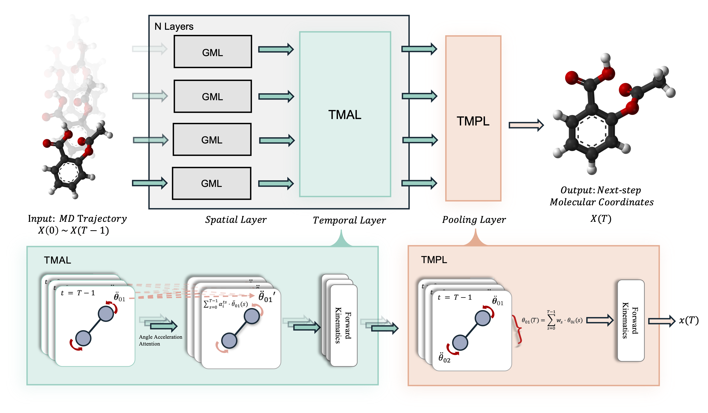

# STEGMN: Spatiotemporal Equivariant Graph Mechanics Networks for Molecular Trajectory Prediction



## Abstract

Molecular trajectory prediction—inferring future atomic 3D positions from past conformations—is fundamental to computational chemistry, drug discovery, and materials simulation, enabling insights into dynamics, reaction pathways, and conformational stability. Its natural alignment with graph-structured spatiotemporal data has made it a key frontier in GNN research. However, current mainstream spatiotemporal GNNs, while enforcing E(3)-equivariance, treat atoms as unconstrained point masses and lack explicit rigid geometric constraints, often yielding unphysical deformations that compromise predictive interpretability. To address this challenge, we propose the Spatiotemporal Equivariant Graph Mechanics Network (STEGMN), the first spatiotemporal graph architecture for molecular trajectory prediction that explicitly encodes rigid constraints. Inspired by Graph Mechanics Networks, we design a constraint-preserving equivariant spatiotemporal attention mechanism that captures temporal dependencies while rigorously maintaining both E(3)-equivariance and rigid-body constraints. Additionally, we introduce a constraint-preserving equivariant pooling module that generates future states by performing a learnable weighted aggregation of historical angular velocities, followed by forward kinematics mapping. This ensures that all outputs simultaneously satisfy E(3)-equivariance and strict bond-length conservation. On real-world molecular dynamics datasets, rMD17 and AdK, STEGMN outperforms strong equivariant baselines, reducing the prediction error by 40% on average for small molecules—highlighting the value of explicit constraint modeling for physically stable trajectory prediction.

## Model Architecture

**Overall Architecture of STEGMN**

The model takes molecular trajectory from time steps 0 to T-1 as input and predicts molecular spatial configuration at time step T. At each time step, atomic coordinates are first processed by a GMN-based spatial module to model local geometry and spatial interactions, enabling effective spatial feature fusion. Subsequently, temporal information is integrated via the Temporal Mechanics Attention Layer (TMAL). Spatial and temporal modules are applied alternately across layers to progressively fuse spatiotemporal features. Finally, the Temporal Mechanics Pooling Layer (TMPL) aggregates structural information to generate the system configuration at the next time step.

The overall architecture of STEGMN comprises the following core components:

1. **GMN-based Spatial Graph Mechanics Layer**: Adopts Graph Mechanics Networks as the foundational spatial modeling module, explicitly encoding rigid geometric constraints while ensuring E(3)-equivariance
2. **Temporal Mechanics Attention Layer (TMAL)**: Constraint-preserving equivariant spatiotemporal attention mechanism that uses angular acceleration as attention values for message aggregation
3. **Temporal Mechanics Pooling Layer (TMPL)**: Constraint-preserving equivariant pooling layer that predicts future states by learning weighted aggregation of historical angular velocities

## Key Features

- ✨ **Physics-Constrained**: First to explicitly encode rigid geometric constraints in spatiotemporal graph neural networks
- 🔄 **E(3)-Equivariant**: Strictly preserves rotational, translational, and reflection symmetries
- 🕒 **Temporal Modeling**: Effectively captures dynamic evolution patterns of molecular systems
- 🏗️ **Graph Mechanics Integration**: Architecture design based on generalized coordinates and forward kinematics
- 📈 **High Accuracy**: Significantly outperforms existing baselines in molecular trajectory prediction tasks

## Experimental Results

### rMD17 Small Molecule Dataset

| Molecule | MSE (×10⁻³) | MAE (Å) |
|----------|-------------|---------|
| Aspirin | **0.393** | **0.014** |
| Benzene | **0.084** | **0.007** |
| Ethanol | **0.331** | **0.013** |
| Malonaldehyde | **0.264** | **0.011** |
| Naphthalene | **0.398** | **0.016** |
| Salicylic acid | **0.365** | **0.014** |
| Toluene | **0.338** | **0.014** |
| Uracil | **0.251** | **0.011** |

### AdK Equilibrium Dataset

| Model | MSE | MAE |
|-------|-----|-----|
| STEGMN | **1.582** | **0.767** |
| ST-EGNN | 1.599 | 0.770 |


## Key Innovations

### 1. Temporal Mechanics Attention Layer (TMAL)
- Uses angular acceleration as attention values, ensuring hard constraints are preserved during temporal computation
- Avoids structural distortions caused by feature drift or overfitting in conventional equivariant temporal attention mechanisms

### 2. Temporal Mechanics Pooling Layer (TMPL)
- Learnable weighted aggregation of historical angular velocities based on generalized coordinates
- Ensures outputs satisfy both E(3)-equivariance and preserve topological integrity of molecular structures through forward kinematics mapping

## Citation

If you use our work in your research, please cite:

```bibtex
@article{miao2025stegmn,
  title={STEGMN: Spatiotemporal Equivariant Graph Mechanics Networks for Molecular Trajectory Prediction},
  author={Miao, Yangyang and Qian, Quan},
  year={2025}
}
```

## Contact

- **Yangyang Miao**: miaoyy@shu.edu.cn
- **Quan Qian**: qqian@shu.edu.cn

## Acknowledgments

This work was sponsored by Advanced Materials-National Science and Technology Major Project (Grant No.2025ZD0620100), National Key Research and Development Program of China (No. 2023YFB4606200), Key Program of Science and Technology of Yunnan Province (No.202302AB080020). The authors gratefully appreciate the anonymous reviewers for their valuable comments.

---

**Data and Code Availability**: Data and source code supporting the findings are available at https://github.com/miao2y/STEGMN
